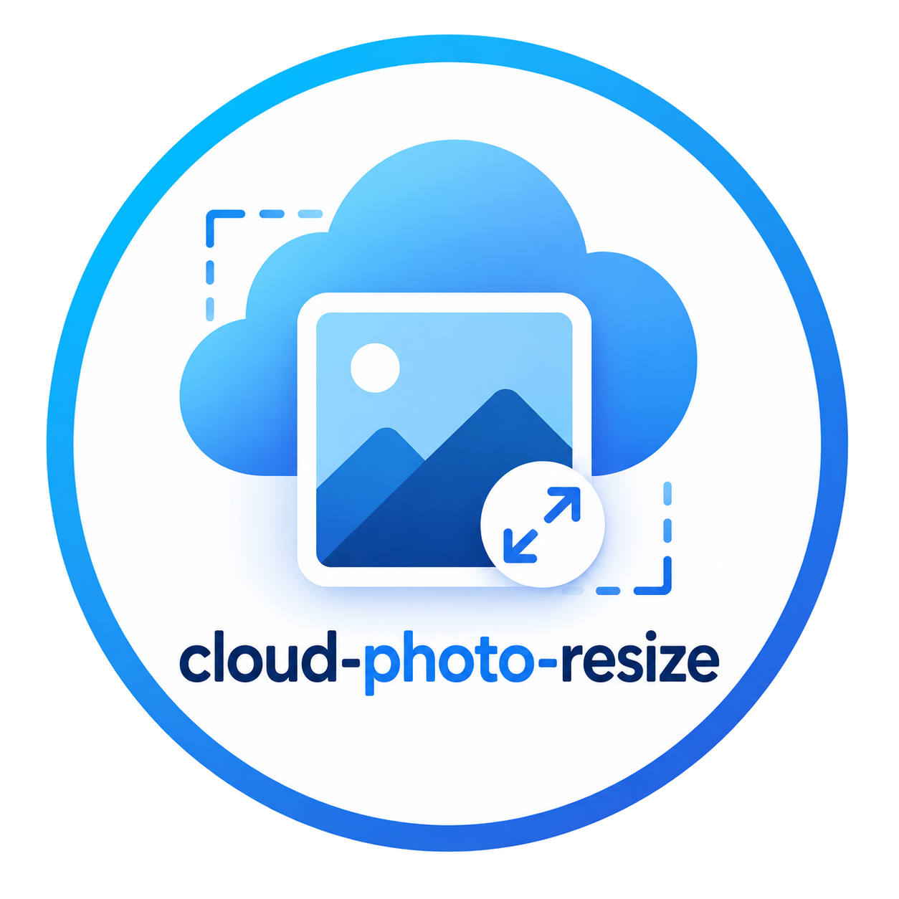
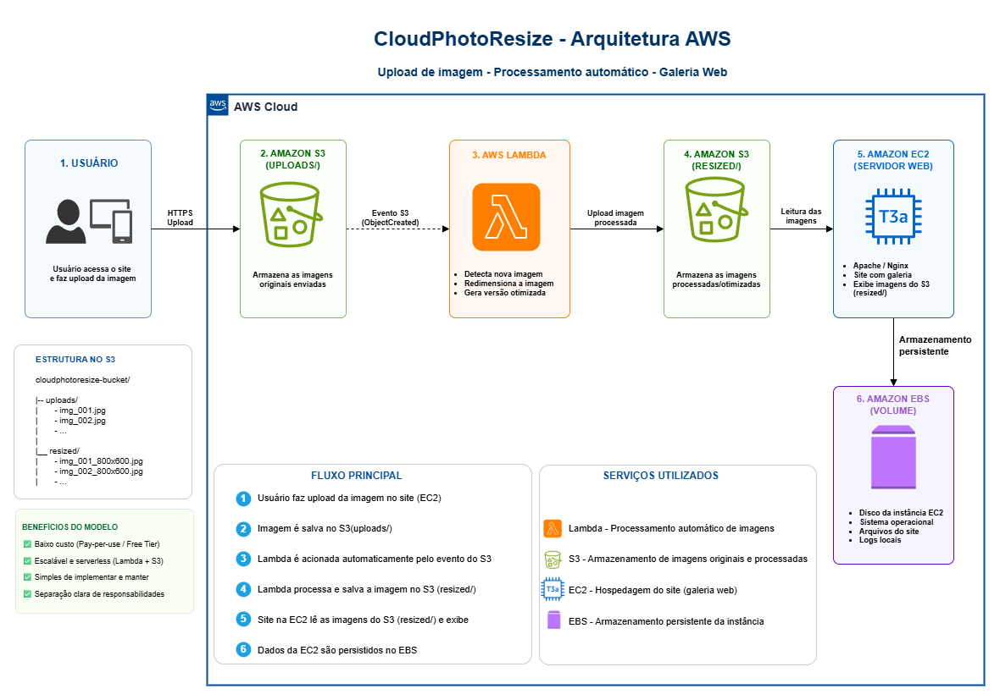

  

# CloudPhotoResize - AWS Project Diagram

 ### Apresentação
 Este é o repositório desenvolvido para consolidar os conhecimentos iniciais em gerenciamento de instâncias EC2 na AWS, abordando também a aplicabilidade dos conceitos de EBS, S3 e Lambda. Projeto com o objetivo de documentar minha experiência e demonstrar minha compreensão dos temas abordados sobre como construir soluções em nuvem com a Amazon Web Services.

 [Descrição Técnica da Arquitetura](/docs/descricao_do_projeto.md)

&nbsp;

 # Diagrama do Projeto

  

&nbsp;

## 💻 Tecnologias utilizadas no projeto

  
  
  <a target="_blank" href="https://docs.aws.amazon.com/ec2/?icmpid=docs_homepage_featuredsvcs">
    &nbsp;Amazon Elastic Compute Cloud - EC2
  </a>
  

  
  
  <a target="_blank" href="https://docs.aws.amazon.com/s3/?icmpid=docs_homepage_featuredsvcs">
    &nbsp;Amazon Simple Storage Service - S3
  </a>
  

  
  
  <a target="_blank" href="https://docs.aws.amazon.com/ebs/?icmpid=docs_homepage_storage">
    &nbsp;Amazon Elastic Block Storage - EBS
  </a>
  

  
  
  <a target="_blank" href="https://docs.aws.amazon.com/lambda/?icmpid=docs_homepage_featuredsvcs">
    &nbsp;AWS Lambda - Lambda
  </a>
  

&nbsp;

## 🧠 Compreensão dos temas discutidos
Apesar de não estar explicitamente abordado neste projeto em específico, e por se tratar de foco na aplicabilidade dos conceitos de EC2, EBS e S3, eu explano abaixo todos os conceitos aprendidos que estão nas entrelinhas da viabilização de qualquer projeto na AWS com o mínimo de segurança, responsabilidade e confiabilidade. O projeto foca na concepção diagramática de aplicação prática dos conceitos de EC2, EBS, S3 e Lambda, de forma detalhada, muito embora se trate claramente de um MVP.

&nbsp;

### Modelo de Negócio da AWS
- No modelo de negócio da AWS a responsabilidade é compatilhada, sendo a AWS responsável pela segurança Da Nuvem, e o cliente responsável pela segurança Na Nuvem

### Configuração da conta AWS e práticas de segurança
- Após criarmos nossa conta root, devemos criar grupos de usuarios com Policies específicas para refletir o conceito do menor privilegio. Mesmo para nós, enquanto administradores, devemos criar um conta com privilégios muito bem avaliados, já que seria quase uma conta root, onde certamente anexaríamos a policy AdministratorAcces.
- Usar minimamente a conta root, proteger todas as contas com MFA, não compartilhar senhas, AccesIds, AccesKeys, enfim, nenhum dado da conta. 
- Forçar MFA em todas as políticas por grupo, em vez de estabelecer isso em cada user criado.
- Se usar Google Authenticator, endureça seu MFA com sua impressão digital, caso essa tecnologia esteja disponível no seu dispositivo. Por se tratar de multiplos fatores, além de algo que sabemos (senha, pin, resposta secreta), ainda podemos adicionar outros fatores como: algo que possuímos (token, celular, chave física FIDO2) e algo que somos (rosto, impressão digital, íris, voz).
- Além disso ainda podemos adicionar mais barreiras técnicas como implementar AccessKey para utilizar com CLI de forma segura.
- Se criou usuarios em massa para finalidade de estudos, depois remova-os para evitar problemas com segurança, principalmente porque provavelmente você pode ter adicionado policies sensíveis de altos poderes a determinados grupos para os quais você apontou esses usuários. 

#### IAM Identity Center
- Preferi não habilitar o IAM Identity Center porque em 2024 quando foi gravado o curso, a AWS tinha uma outra realidade em relação ao uso desse recurso X Free Tier. Agora em 2026 porém, ao ativar, os créditos do Free Tier expiram automaticamente e tudo passa a ser cobrado. Então seguindo até mesmo a orientação do professor, devemos sempre ficar atentos às mudanças constantes na AWS, principalmente para um eficiente controle de custos.

### Foco no Controle de Custos
- Assim que entrei na conta configurei logo os budgtes, para não ter surpresas, como estudante, com possíveis cobranças no cartão de crédito. Além disso, treinar bastante a ferramenta Pricing Calculator da AWS e analisar bem os cases pra poder escolher instâncias mais adequadas e também praticar comportamentos relevantes que não estão diretamente ligados AWS, como desligar uma instância em determinado horário se não for ser utilizada. Além do controle com as instâncias também tem vários fatores/recursos que precisam ser bem avaliados na hora de criar as soluções em AWS para ter o maior controle e o menor custo possíveis.
>- Por isso no meu MVP, no meu diagrama escolhi uma instância t3a.micro, que usa cpu AMD EPYC e tem custo menor se comparado a mesma instância usando cpu Intel Xeon (t3.micro), já que se trata de MVP, site leve e outros fatores que justificam essa escolha.

&nbsp;

## 💡 Insights

Ao estudar e ponderar sobre as técnicas de segurança e no contexto da implementação de barreiras extras, me ocorreu o seguinte:

>CLI
- É fato que configuramos as credenciais da AWS no gitbash e elas ficam "eternamente" gravadas na pasta "C:\Users\seu-nome-de-usuario\\.aws" (isso para usuarios de Windows). Contudo essas informações ficam em simples arquivos de texto criados com os nomes de "config" e "credentials" e nesse caso se tornam totalmente vulneráveis. Como uma medida adicional podemos criar uma sessão temporária autenticada via MFA com um token que dura 12 horas, baseando-se no ARN (Amazon Resource Name) do seu MFA: "MFA_ARN="arn:aws:iam::seu-id-de-12-digitos:mfa/user-name-do-seu-mfa". Só depois disso voce roda os scripts que precisar rodar.
- Você pode ver aqui o [arquivo bash de autenticação](./docs/aws-login.sh) para executar essa tarefa no seu gitbash antes de rodar seus scripts de automação. Você deve rodar esse script com "source ./script.sh" porque senão tudo o que foi processado no script morrerá junto com o fim da execução do seu sh.
- Sobre deixar a AccessKey ativada: prefiro desativar se não estiver usando no momento, e não apenas porque a chave não está sendo utilizada há muito tempo. Por exemplo, se estou estudando outra coisa que não precise da AccessKey, prefiro deixa-la sempre desativada.

>PowerShell
- Caso queira se sentir mais seguro ao configurar seus dados de acesso com "aws configure" de forma mais "oculta":
1. Na hora que gerar sua AccessKey, faça o download do csv das suas credenciais para a sua pasta download.
2. Rode o shell ([importar-credenciais.ps1](./docs/importar-credenciais.ps1)) para que suas credenciais sejam automaticamente preenchidas de forma oculta com aws configure.

Obs: apesar de ser uma forma muito pratica e segura, mesmo assim nao deixe de treinar o "aws configure" da forma tradicional, pra não perder a prática.

&nbsp;

## 💻 Scripts Úteis & Outros
Você deve usar esses scripts colocando no fim da linha de comando o nome do arquivo csv para ser executado. Por via das dúvidas, por questão de segurança e como esse csv não deve subir no Github por conter nomes, senhas, grupos - mesmo que você use pra testes, fica vunerável colocar dados aqui. Por isso criei esse prompt para que seja gerado um arquivo com o Gemini pois o Copilot não gera o arquivo direto e o ChatGpt não separa as colunas.

Não esqueça de criar os grupos na sua conta com os nomes exatamente iguais aos gerados no csv pelo Gemini, antes de rodar os Scripts.
&nbsp;

Para fixar melhor, após criado o csv pelo Gemini, veja quais grupos ele criou e configure policies de acordo com os grupos criados, antes de rodar os Scripts.

### Instruções:

1. Copie o [prompt](./docs/prompt-criar-tabela-csv.md).
2. Abra o [Gemini](https://gemini.google.com/app?hl=pt-BRvvvv).
3. Cole o prompt.
4. Baixe o arquivo csv gerado para a mesma pasta onde colocar os Scripts.
5. Execute os Scripts para testar.

[Script Criar Usuários](./docs/scriptIAM.sh)
&nbsp;

[Script Remover Usuários](./docs/faxina-aws.sh)

&nbsp;

## 👨‍💻 Arquiteto

    
    
&nbsp&nbsp&nbspEdmundo Batista 
    &nbsp&nbsp&nbsp
    <a 
        href="https://github.com/eddgh">
        GitHub
    </a>
    &nbsp;|&nbsp;
    <a 
        href="https://linkedin.com/in/edmundo-jos%C3%A9-3660b76a">
        LinkedIn
    </a>

  

---

⌨️ com 💜 por [Edmundo Batista](https://github.com/eddgh)
